# Prévision du Mix Énergétique Français

## Introduction

Le but fondamental de cette initiative est de concevoir un modèle d'intelligence artificielle ayant la capacité de anticiper la composition du mix énergétique en France pour la journée suivante.

### Source des Données ( [Download](https://www.rte-france.com/eco2mix/telecharger-les-indicateurs) )

Nous avons choisi d'utiliser les données du mix énergétique fournies par RTE pour l'entraînement de nos modèles. Ces données, accessibles au public, sont d'une fiabilité élevée.  
Les données téléchargées couvrent la période du 01/01/2019 au 31/05/2022 et portent sur la production en mégawatts des énergies primaires: Fioul, Charbon, Gaz, Nucléaire, Éolien, Solaire, Hydraulique et Bioénergies. Les données sont actualisées toutes les 30 minutes, ce qui permet de développer un modèle d'une grande précision.  

    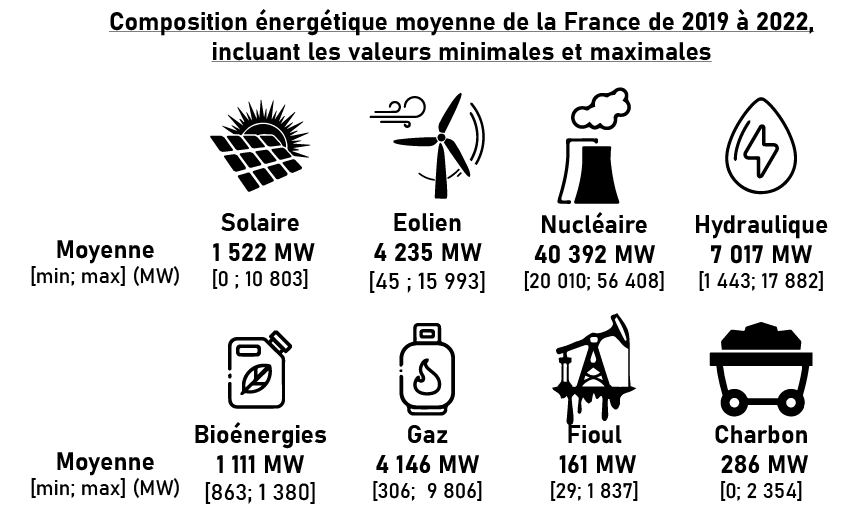

### Approche

L'objectif consiste à créer un modèle de machine learning apte à anticiper le mix énergétique de chaque source d'énergie toutes les 30 minutes en se basant sur les données des jours précédents. Afin de faciliter la comparaison entre mes divers modèles, j'ai opté pour l'utilisation d'une fonction de perte commune. J'ai choisi d'utiliser la fonction de perte qui correspond à la moyenne de la somme des erreurs quadratiques pour chaque intervalle de demi-heure et chaque source d'énergie principale sur l'ensemble des jours d'un batch.  
J'ai également appliqué une max-normalisation à chaque colonne de mes données, étant donné la disparité dans la production électrique de chaque source d'énergie principale. Sans cette normalisation, le modèle aurait eu tendance à privilégier la prédiction de certaines sources d'énergie primaire très productive, alors qu'avec cette approche, chaque source d'énergie a un poids équivalent

## Premier model

### Approche

Mon approche pour construire ce modèle de machine learning repose sur l'intuition que les données quotidiennes présentent des motifs répétitifs. Pour capturer ces schémas temporels, j'ai opté pour une première couche ConvNet 1D.

### DATA

Les données d'entraînement sont segmentées par batch de `nb_days_by_batch` jours. Ces batchs couvrent la plage temporelle du 1er janvier 2019 au 30
mai 2021. Quand à elles, les données de test englobent la période allant du 31 mai 2021 au 31 mai 2022.

L'input du modèle est constituée du mix énergétique des `nb_days_cnn` jours précédant le jour à prévoir.

### Description du model

    
    
Description du

### Hyperparamétre

- `nb_epoch`: Nombre d'epochs pour l'entraînement.
- `lr`: Taux d'apprentissage de l'optimiseur.
- `hidden_layer`: Nombre de "channels" produits par la convolution.
- `nb_days_cnn`: Longueur du noyau (en nombre de jours) pour la convolution.
- `nb_days_by_batch`: Nombre de jours par lot (batch).
- `batch_normalization`: Booléen, si défini sur "true", une normalisation est ajoutée entre chaque enregistrement pris à la même heure.

### Analyse des réultats

#### Analyse n°1

La normalisation des inputs n'est pas essentielle, et elle entraîne une perte d'information sur les jours précédents qui présentent des similitudes avec le jour à prédire. J'ai tracé les courbes de perte d'entraînement et de test en fonction des époques (`nb_epoch=300, lr=0.0001, hidden_layer=48, nb_days_cnn=6, nb_days_by_batch=46`)

    <figure>
        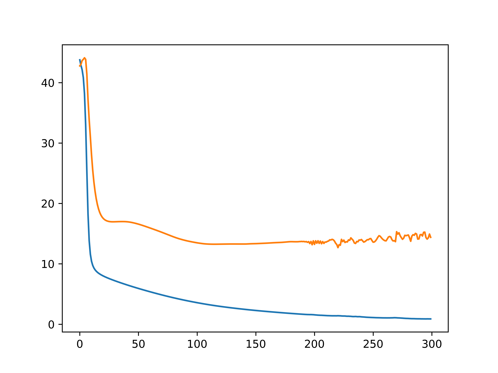
        <figcaption>Loss function of train (bleu) et test (orange) with normalization</figcaption>
    </figure>
    <figure>
        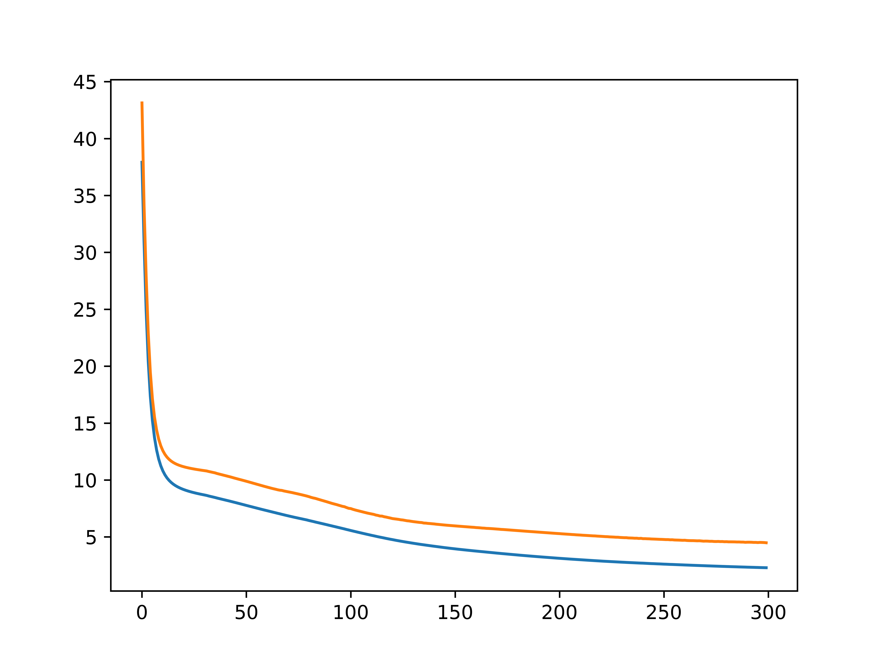
        <figcaption>Loss function of train (bleu) et test (orange) without normalization</figcaption>
    </figure>

#### Analyse n°2

L'utilisation d'un modèle avec une convolution (CNN) peut ne pas être appropriée pour certains types de valeurs. En affinant les hyperparamètres, les modèles ne parviennent pas à atteindre une valeur inférieure à 4 sur la base de test avant d'overfit.

    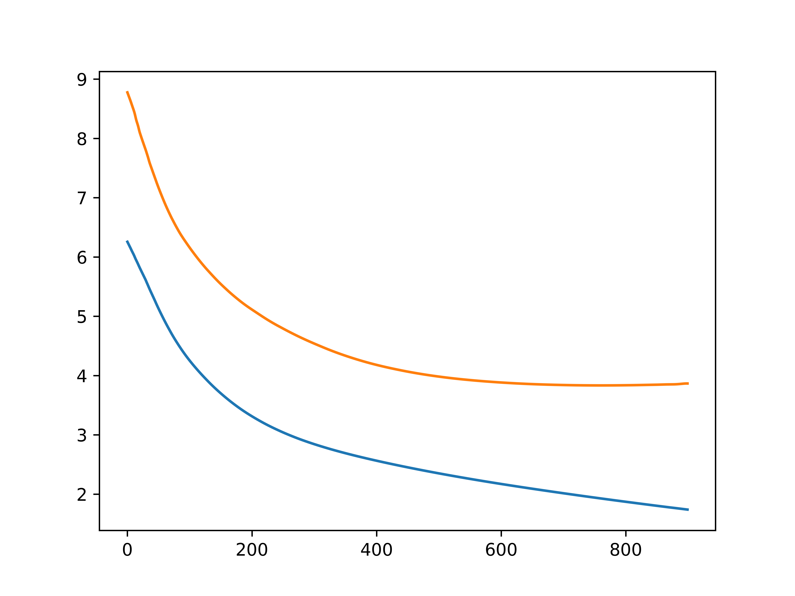
    
Loss function of train (bleu) et test (orange) overfiting

J'ai choisi d'afficher les prédictions du modèle et les valeurs réelles de production pour un lot de 13 jours sur l'ensemble de test. On remarque que la précision des prévisions dépend fortement du type d'énergie primaire. Pour certains types; tels que l'énergie solaire, hydraulique et Nucléaire; les prévisions sont assez précises en raison de la nature cyclique de leur production quotidienne. Dans le cas du solaire, la production dépend uniquement de l'ensoleillement, et le taux d'ensoleillement est similaire aux jours précédents, contribuant ainsi à des prévisions plus fiables.

    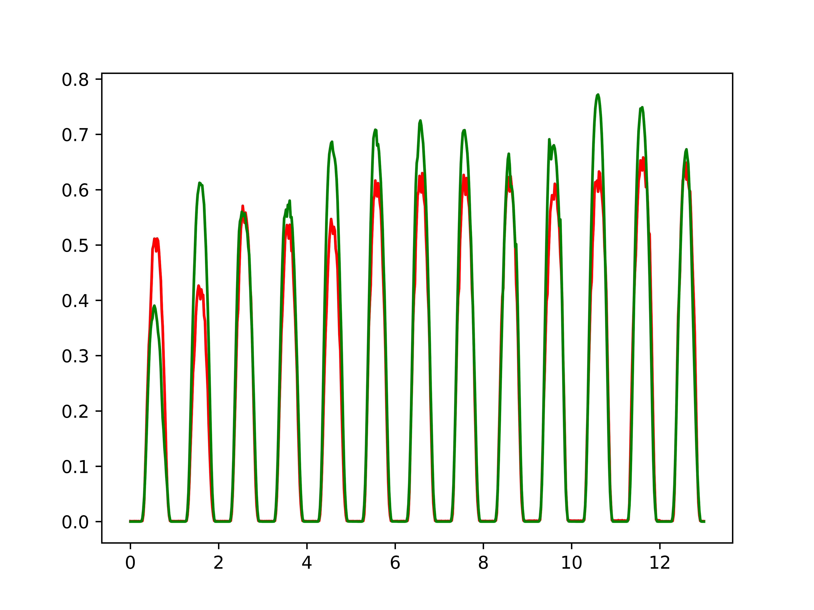
    
Prévision production solaire ( en rouge) et valeur réelle à J+1 (en vert)

Cependant, certains types de production ne suivent pas du tout un cycle quotidient. RTE augmente la production uniquement lorsque la demande est ponctuellement importante. Le modèle peine à anticiper cette augmentation et s'adapte qu'au jour suivant. C'est surtout le cas pour la production de gaz, fioul et charbon, des énergies utilisé en dernier recours.

    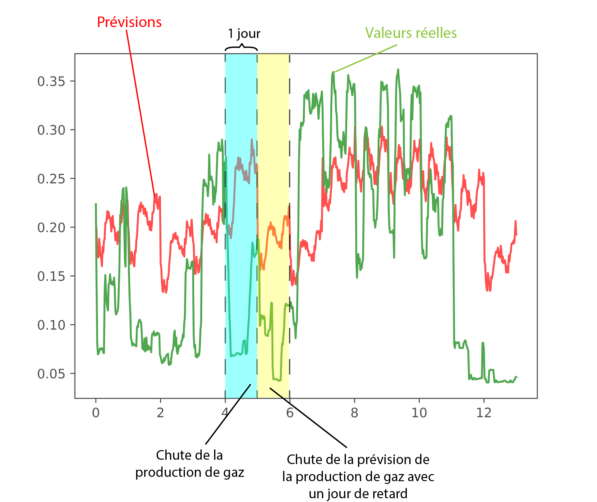
    
Prévision production dez (en rouge) et valeur réelle à J+1 (en vert)

Pour ces types d'énergie primaire, l'utilisation d'un modèle CNN pour les prévisions n'est pas optimale. Un modèle RNN pourrait offrir de meilleures performances, car il capte une tendance, et il peut prédir les causes, d'un pic de production.

## Deuxième model & troisième model

### Approche

En examinant les résultats du premier modèle, j'ai décidé de segmenter les entrées en deux catégories distinctes. D'une part, les données présentant un motif quotidien, et d'autre part, celles ne présentant aucun motif quotidient apparent.

### DATA

Tout comme dans le modèle précédent, les entrées sont réparties par batch. La principale distinction réside dans l'introduction des listes `indice_periodic` et `indice_no_periodic`, qui recensent respectivement les indices des colonnes représentant les données à motif quotidien ("Solaire","Hydraulique","Nucléaire") et celles sans motif.

### Description du model

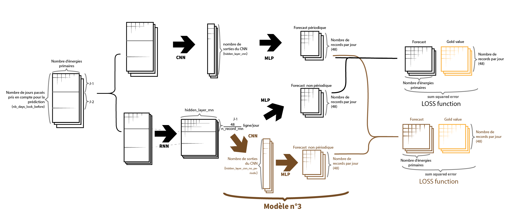

### Hyperparamétre

#### Model 2

- `nb_epoch`: Nombre d'epochs pour l'entraînement.
- `lr`: Taux d'apprentissage de l'optimiseur.
- `nb_days_by_batch`: Nombre de jours par lot (batch).   
- `hidden_layer_cnn`: Nombre de features produits par la convolution.
- `nb_days_look_before`: Longueur du noyau (en nombre de jours) de la convolution pour la prédiction des énergie dite périodique.
- `n_record_rnn`: Nombre de demi-heure en input du RNN (input RNN = n_record_rnn \* nb_energie_primaire )
- `hidden_layer_rnn`: nombre de features produit par le RNN.

#### Model 3

- `nb_epoch`: Nombre d'epochs pour l'entraînement.
- `lr`: Taux d'apprentissage de l'optimiseur.
- `nb_days_by_batch`: Nombre de jours par lot (batch).   
- `hidden_layer_cnn`: Nombre de features produits par la convolution de pour la prédiction des énergie dite périodique.
- `nb_days_look_before`: Longueur du noyau (en nombre de jours) pour la convolution pour les énergie dite périodique.
- `n_record_rnn`: Nombre de demi-heure en input du RNN (input RNN = n_record_rnn )
- `hidden_layer_rnn`: nombre de features produit par le RNN.
- `hidden_layer_cnn_no_periodic`: Nombre de features produits par la convolution de pour la prédiction des énergie dite non périodique.

### Analyse des réultats

Les résultats présentent une légère amélioration par rapport au modèle 1, mais cette amélioration n'est pas significative. Globalement, les performances sont bonnes, avec une fonction de perte qui converge vers 3, ce qui est légèrement meilleur que le modèle 1. Les 2 models ont des performances assez comparable et converge vers les même type de prévision

    

        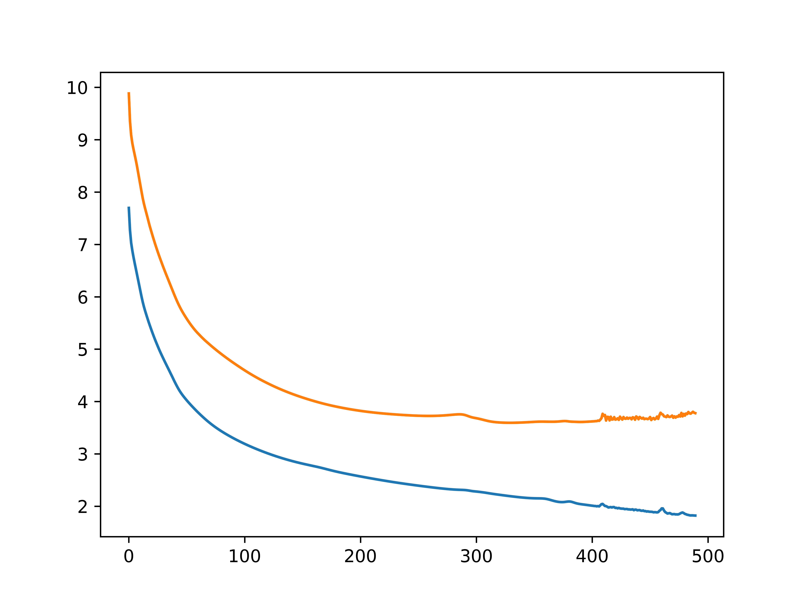
        

            Loss function of train (bleu) et test (orange)  of the model 2
        

    

    

        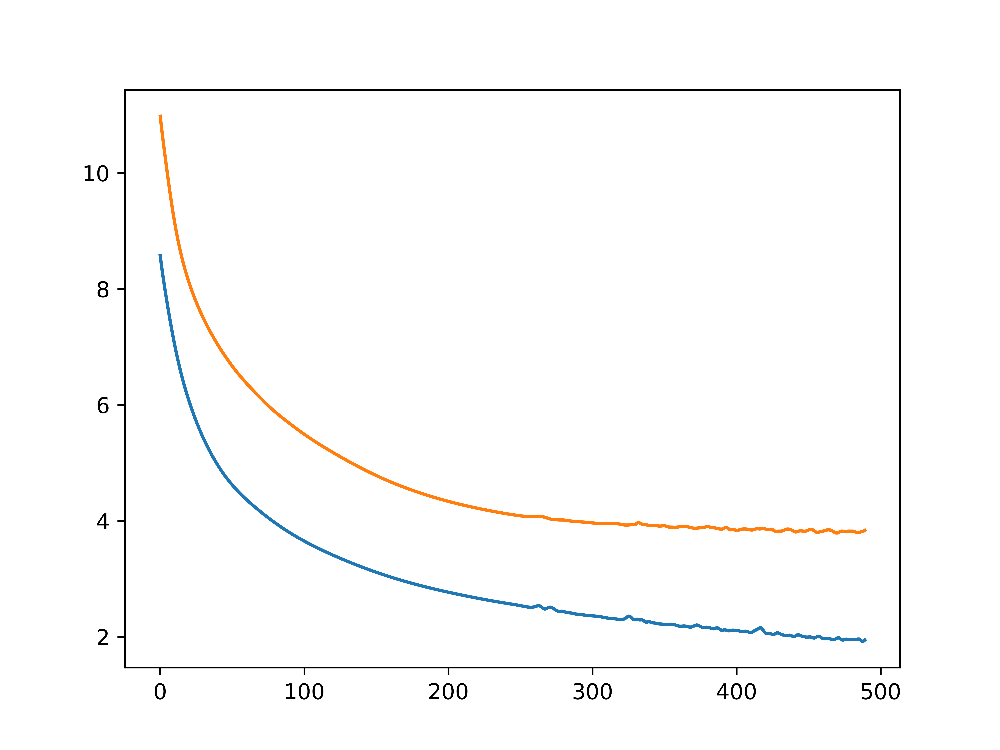
        

            Loss function of train (bleu) et test (orange)  of the model 3
        

    

Comme prévu, les prévisions pour les énergies périodiques restent très performantes, puisqu'aucune modification n'a été apportée au modèle dans ces models.

Malgré certaines améliorations observées pour les énergies non périodiques, le modèle continue de rencontrer des difficultés dans la prédiction les sursauts de production, notamment pour les énergies issues du fioul et du charbon, qui sont rarement utilisées sauf en cas de pics de 1 à 2 heures.

    

        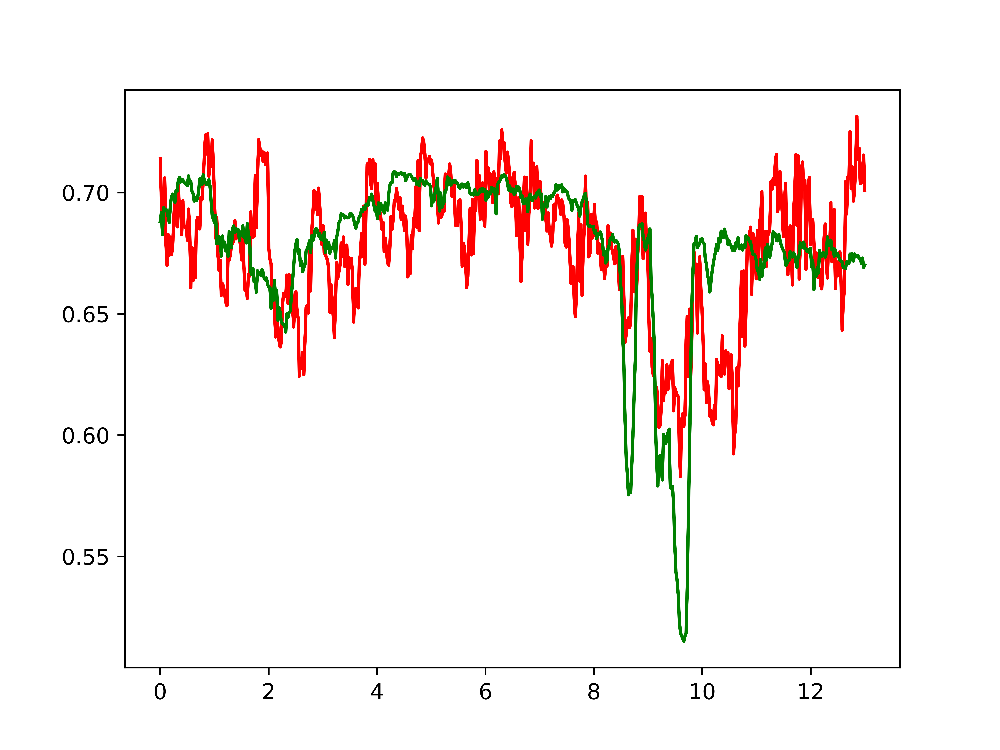
        

            Prédiction de la bioénergies du model 3 
            prédiction (rouge) & vraie valeur (vert)
        

    

    

        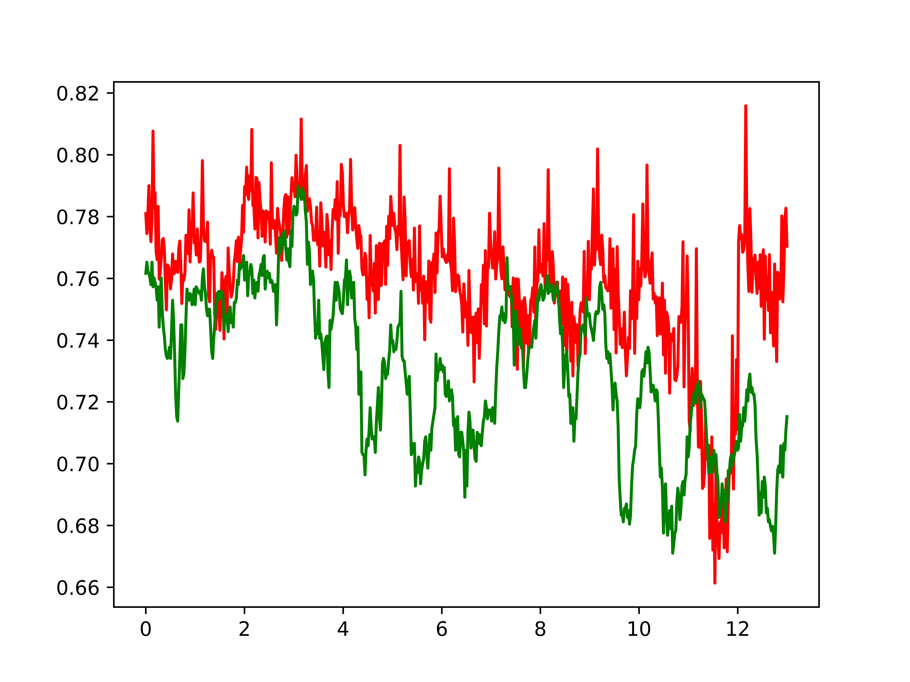
        

            Prédiction de la bioénergies du model 1 
            prédiction (rouge) & vraie valeur (vert)
        

    

 

    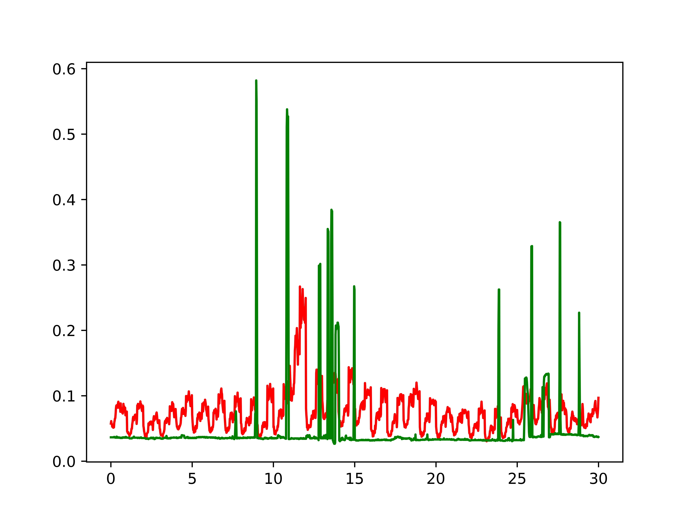
    

        Prédiction de la Fioul du model 3 
        prédiction (rouge) & vraie valeur (vert)
    

## Conclusion

La prévention à travers des modèles d'apprentissage automatique est un exercice intéressant, car il met en évidence que la production des différentes énergies primaires se comportent très différemment. Il souligne également l'importance de comprendre les données que l'on manipule, pour construire un model puissant il est nécessaire de comprendre comment RTE prend des décisions quant au choix de production avec telle ou telle source d'énergie primaire. Cela est essentiel pour construire un modèle puissant et efficace.
Pour améliorer ce modèle, l'approche ne serait pas tant de créer un modèle plus complexe, mais plutôt d'enrichir les données d'entrée. Une suggestion d'amélioration consisterait à incorporer les données météorologiques et celles relatives à l'état du marché européen de l'énergie dans l'input du modèle. Avec une telle modification, il serait potentiellement possible d'anticiper de manière plus efficace les pics de production.
